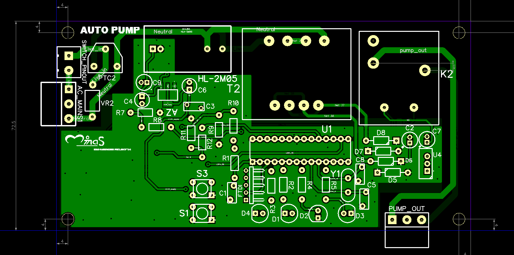
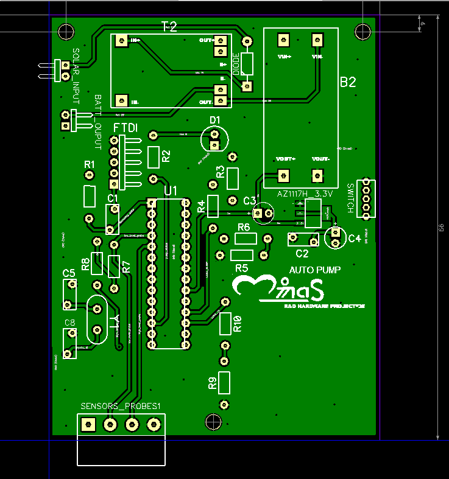

# Radio Frequency Automatic Water Pump Controller

This project involve building an automatic pumping machine controller which uses Radio Frequency through LoRa to communicate between the Water pump controller switch and the reservoir water level. Therefore this project has two distinct devices, one of them called the Automatic pump controller `(APC)` which performs the switching of the water pump, and a second device which I called Automatic Water Sensing  `(AWLS)` which monitors the reservoir water level. The AWS device sends information about the water level to the APC, and these information enables the entire system to automatically switch ON/OFF the water pump. Various processes of the design are documented here....

---
## Automatic Pump Controller (APC) Device PCB 

### Components Used include:
- Transformer
- 30A Relay
- ATmega 328PU Chip
- Resistors
- LEDs
- Voltage Regulators
- LoRa Module (F8L10A), etc...
  
---

## Automatic Water Level Sensing (AWLS) Device PCB

### Components Used Include:
- 5V Solar Panel
- Charging module
- Buck Converter
- ATmega 328PU Chip
- Resistors, capacitors
- Voltage Regualators
- LoRa Module
- Water Level Probes (for sensing)
---

