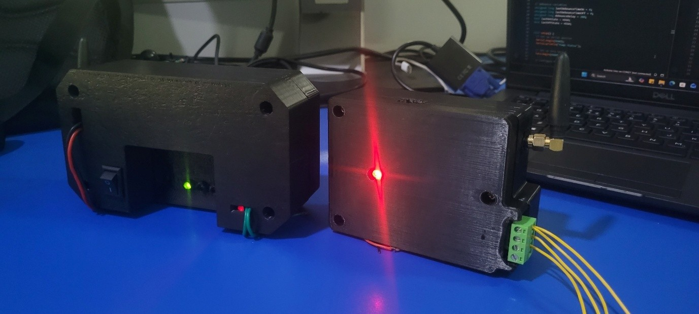
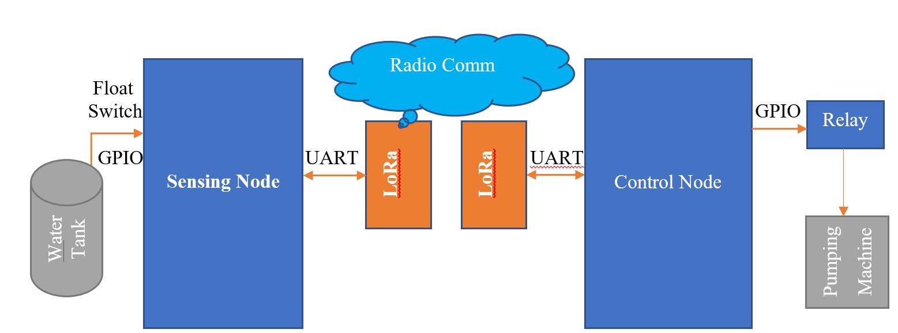
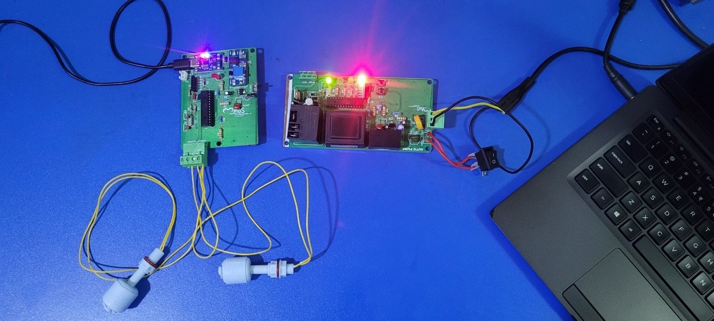

# AUTOMATIC WATER PUMP CONTROLLER

----

**AUTOMATIC WATER PUMP CONTROLLER** `AWPC` is an Long range coverage water pump controller that comprises of two devices.
- The Smart Sensing Device `SSD`
- Smart Pump Controller `SPC`

These two devices work together to enable smart autonomous control of the water pump machine. 

## PROBLEM STATEMENT
Every home and residential buildings around the world and especially in Nigeria using a water pumping machine of a sort. These machines help pump water from the borehole into tanks, or perhaps move water from one reservoir tanks to another which may be kilometers away from one another. Traditionally, manual means were adopted to control these water pump machines by humans manually turning ON the machine control whenever water level is LOW and OFF whenever water spillage is observed which indicates that the water tanks are filled up.

However, there have been advancement over the years. One of which is the introduction of float switches which are Mechanical switches that are placed in the water tank to sense water level in the tank and automatically trigger the Water Pump machine control state based on the water level in the tank. While Float switch have been adopted over time due to its simplicity and effectiveness in preventing water spillage during water pumping, Yet there are limitations to its use. Limitations such as;

- Inability to monitor the water level in the tank in real time
- Inabilty of users to override pumping machine control state
- High cost of installation when Tanks are kilometers away from the Pumping sources (Cost of Cabling)
- Lack of IoT feature which gives users the avanue to overide the control the water pump machine from anywhere in the world via their phones.

The above are the various limitation AWPC addresses. This system provide an IoT based solution with a Feedback closed loop system between the water level in the tank and the water pump machine control. A major advantage of the system is the very long distance coverage feature it provides. The Smart Sensing Device (SSD) can be attached to a water tank which may be 2.5km away from the pumping machine control location without any use of long cabling to connect these two nodes like in traditional Float switches.

AWPC uses LoRaWAN Radio Commuinication system to enable point-to-point communication between the two devices thereby providing long distance communication range of about 2.5km and reducing the cost of installation by introducing a no-cabling systems between the devices involved.

## AREAS OF APPLICATION
The AWPC is suitable for use in Residential, Commercial, Agricultural, and industrial applications to meet various conditions such as when:
- Water Pumping machines are installed kilometers away from the tanks
- Users are required to view water level in real time and to override manually when required
- Users are interested in controlling pumping state from their mobile phones via an application
- Users are interested in understanding their water consumption rate.

----

## MAJOR SYSTEM COMPONENTS
|Smart Sensing Device (SSD)       |     Smart Pump Controller (SPC)   |
|:-------------------------------:|:---------------------------------:|
|DC Powered (3.7V, 2000mAh)       | AC powered (220-240VAC)           |
|5V Solar Panel                   | Transformer 220/17                |
|TP4056 Charging Module           | 30A (T91) Relay                   |
|MT3608 Boost Converter           | Voltage Regulators (AMS1117, LM7812) |
|ATmega328PU chip                 | ATmega328P chip                   |
|LoRa module (F8L10A)             | LoRa module (F8L10A     )         |
|Small Float switch sensors (2)   | HLK-2M05 DC-AC module             |
|Others (Resistors, Capacitors, LEDs, )  | Others (Resistors, Capacitors, Diode, LEDs, etc)   |

## LoRa Module Configuration 
Inorder to enable node to node communication, the LoRa module installed on the two devices were configured separated through the use of AT command. Parameters such as operating frequecies, transission power, individual ID, transmission recipient IDs, and other important parameters where set up on the F8L10A module based on the manufacturer's guideline. below is the complete configuration via HTerm application....

| Parameter      | (SSD) Node     |   (SPC) Node  |
|:-------------------:|:--------------:|:-------------:|
| Node ID             | AT+NID=1       | AT+NID=2      |
| Transparent Address | AT+TID=2       | AT+TID=1      |
| Baud Rate           | AT+IPR=5 (9600) | AT+IPR=5 (9600)|
| Operation Mode      | AT+MOD=0       | AT+MOD=0       |
| PAN Address         | AT+PID=101     | AT+PID=101    |
| LoRa Rate Set       | AT+LRS=6       | AT+LRS=6      |

